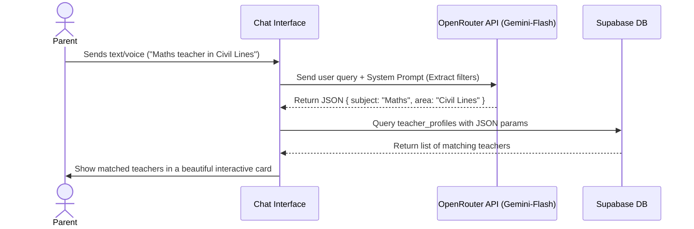

# Takhti - OpenRouter Chatbot Integration Concept

## 🌟 The Problem: Why Current UIs are Complex for Parents
Independent tuition teachers in India cater to parents from diverse educational and socio-economic backgrounds. Many parents—especially in semi-urban and rural areas—find traditional web forms (dropdowns, multiple filters, complex grid layouts) overwhelming. 

However, **95%+ of these parents are extremely comfortable using WhatsApp and Voice Typing.**

---

## 🤖 The Solution: Conversational AI Assistant (Concept)

Instead of a complex Search Page with multiple dropdown filters, we can introduce a **conversational chatbot interface** powered by **OpenRouter (Gemini / Claude)**. 

### 1. The Interaction Flow (Simplified Parent Journey)
- **Step 1:** The parent opens `takhti.app`.
- **Step 2:** Instead of a complex form, they see a simple chat bubble: 
  > *"Namaste! Main Takhti AI Assistant hoon. Aapko apne bacche ke liye kis subject ya class ka teacher chahiye? Aap niche bol kar bhi bata sakte hain."*
- **Step 3:** The parent can either type or click the microphone icon to speak:
  > *"Mera beta 8th class me hai, mujhe uske liye Maths aur Science ka teacher Mohalla Civil Lines me chahiye."*
- **Step 4:** The AI parses this natural language, extracts the parameters, calls our backend database, and displays a clean carousel of matching teachers directly inside the chat.
- **Step 5:** The parent taps **"WhatsApp Par Baat Karein"** to connect instantly.

---

## 🛠️ Technical Architecture (No-Code Blueprint)



### Prompt Engineering: Intent Extraction Example
When the parent speaks, we send their raw text to OpenRouter with a structured system prompt:

```typescript
const systemPrompt = `
  You are the Takhti AI Assistant. Your job is to extract search parameters from Indian parents' queries (often in Hinglish or Hindi).
  Extract:
  - class_level (e.g., "8th", "Class 5")
  - subject (e.g., "Maths", "Science")
  - area_mohalla (e.g., "Civil Lines", "Shastri Nagar")
  - city
  
  Format your response strictly as JSON. Example output:
  { "class_level": "8", "subject": "Maths", "area_mohalla": "Civil Lines" }
`;
```

---

## 💡 Key UX Enhancements for Maximum Simplicity

1. **Voice-to-Text Button (Mic Icon):** Integrates native browser Web Speech API so parents don't even have to type. They can just speak their requirement in Hindi, Hinglish, or English.
2. **One-Tap Actions:** Inside the chat, show quick pill buttons like:
   - 📌 *"Maths Teacher"*
   - 📌 *"Class 10th"*
   - 📌 *"Home Tuition"*
3. **No Login for Parents:** Parents do not need to register or log in to search. Direct frictionless access increases conversion rates by 80%.
